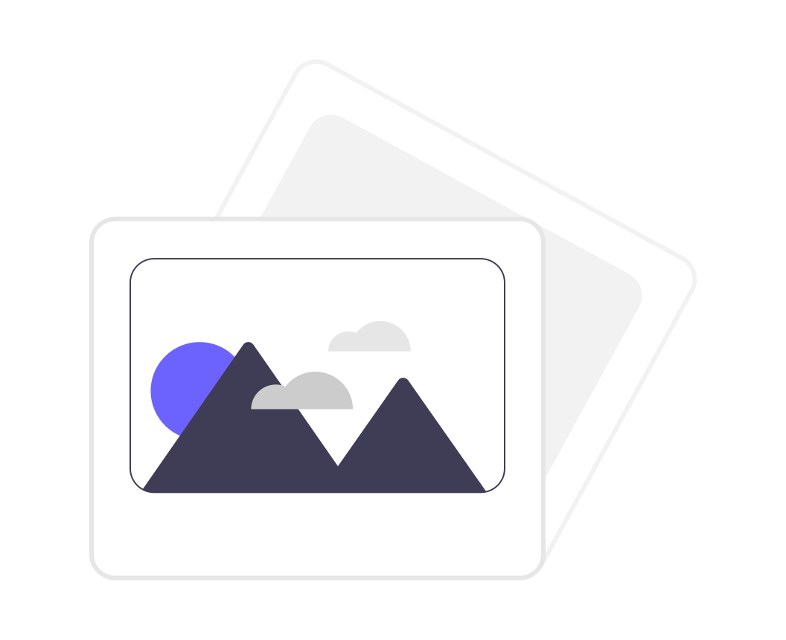

# Photo album
<div id="top"></div>

<!-- PROJECT SHIELDS -->
<!--
*** I'm using markdown "reference style" links for readability.
*** Reference links are enclosed in brackets [ ] instead of parentheses ( ).
*** See the bottom of this document for the declaration of the reference variables
*** for contributors-url, forks-url, etc. This is an optional, concise syntax you may use.
*** https://www.markdownguide.org/basic-syntax/#reference-style-links
-->
<!-- [![Contributors][contributors-shield]][contributors-url]
[![Forks][forks-shield]][forks-url]
[![Stargazers][stars-shield]][stars-url]
[![Issues][issues-shield]][issues-url]
[![MIT License][license-shield]][license-url]
[![LinkedIn][linkedin-shield]][linkedin-url] -->


<!-- PROJECT LOGO -->
<br />
<div align="center">
  <a href="https://github.com/Workata/photo-album">
    
  </a>

  <h3 align="center">Photo album</h3>

  <p align="center">
    Online album to share, categorize and map your images!
    <br />
    <!-- <a href="https://github.com/othneildrew/Best-README-Template"><strong>Explore the docs »</strong></a> -->
    <br />
    <br />
    <a href="https://github.com/Workata/photo-album#usage">View Demo</a>
    ·
    <a href="https://github.com/Workata/photo-album/issues">Report Bug</a>
    ·
    <a href="https://github.com/Workata/photo-album/issues">Request Feature</a>
  </p>
</div>


<!-- TABLE OF CONTENTS -->
<details>
  <summary>Table of Contents</summary>
  TODO
  <ol>
    <li>
      <a href="#about-the-project">About The Project</a>
      <ul>
        <li><a href="#built-with">Built With</a></li>
      </ul>
    </li>
    <li>
      <a href="#getting-started">Getting Started</a>
      <ul>
        <li><a href="#prerequisites">Prerequisites</a></li>
        <li><a href="#installation">Installation</a></li>
      </ul>
    </li>
    <li><a href="#usage">Usage</a></li>
    <li><a href="#roadmap">Roadmap</a></li>
    <li><a href="#contributing">Contributing</a></li>
    <li><a href="#license">License</a></li>
    <li><a href="#contact">Contact</a></li>
    <li><a href="#acknowledgments">Acknowledgments</a></li>
  </ol>
</details>


<!-- ABOUT THE PROJECT -->
## About The Project

[![Product Name Screen Shot][product-screenshot]](https://tomtol.pictures)

<!-- TODO change this description -->
Online album to share, categorize and map your images! 

### Built With

<!-- This section should list any major frameworks/libraries used to bootstrap your project. Leave any add-ons/plugins for the acknowledgements section.-->

#### Frontend
* [React.js](https://reactjs.org/)
* [Material UI](https://mui.com/)

#### Backend
* [Fast API](https://fastapi.tiangolo.com/)
* [TinyDB](https://tinydb.readthedocs.io/en/latest/)

#### Deploy
* [Docker](https://www.docker.com/)
* [DigitalOcean](https://www.digitalocean.com/)


<!-- GETTING STARTED -->
## Getting Started

### Prerequisites

#### General
Get API keys (TODO)

#### Development

Install python, pip, npm 

#### Production
Install docker / docker-compose
<!-- This is an example of how to list things you need to use the software and how to install them.
* npm
  ```sh
  npm install npm@latest -g
  ``` -->

&nbsp;

### Installation

#### General
1. Clone the repo
   ```sh
   git clone https://github.com/Workata/photo-album.git
   ```
2. Set API keys (TODO)

#### Development

1. Create venv (backend) - only once
2. Install python libs - backend (requirements.txt) - only once
   ```sh
   cd backend
   pip install -r requirements.txt
   ```
3. Install npm packages - only once
   ```sh
   cd frontend
   npm install
   ```
4. Run backend
   ```sh
   cd backend
   . ./venv/bin/activate
   uvicorn src.main:app --reload
   ```
5. Run frontend
   ```sh
   cd frontend
   . ./venv/bin/activate
   npm start
   ```

#### Production

1. Change domain in Caddyfile

2. Build images using Docker Compose
   ```sh
   sudo docker-compose build
   ```
3. Start containers
   ```sh
   sudo docker-compose up
   ```
<!--
1. Get a free API Key at [https://example.com](https://example.com)
2. Clone the repo
   ```sh
   git clone https://github.com/your_username_/Project-Name.git
   ```
3. Install NPM packages
   ```sh
   npm install
   ```
4. Enter your API in `config.js`
   ```js
   const API_KEY = 'ENTER YOUR API';
   ``` -->

<!-- <p align="right">(<a href="#top">back to top</a>)</p> -->


<!-- USAGE EXAMPLES -->
## Usage

TODO
<!-- Use this space to show useful examples of how a project can be used. Additional screenshots, code examples and demos work well in this space. You may also link to more resources.

_For more examples, please refer to the [Documentation](https://example.com)_

<p align="right">(<a href="#top">back to top</a>)</p> -->


<!-- ROADMAP -->
## Roadmap

TODO

<!-- - [x] Add Changelog
- [x] Add back to top links
- [ ] Add Additional Templates w/ Examples
- [ ] Add "components" document to easily copy & paste sections of the readme
- [ ] Multi-language Support
    - [ ] Chinese
    - [ ] Spanish

See the [open issues](https://github.com/othneildrew/Best-README-Template/issues) for a full list of proposed features (and known issues). -->

<!-- <p align="right">(<a href="#top">back to top</a>)</p> -->


<!-- CONTRIBUTING -->
## Contributing

TODO

<!-- Contributions are what make the open source community such an amazing place to learn, inspire, and create. Any contributions you make are **greatly appreciated**.

If you have a suggestion that would make this better, please fork the repo and create a pull request. You can also simply open an issue with the tag "enhancement".
Don't forget to give the project a star! Thanks again!

1. Fork the Project
2. Create your Feature Branch (`git checkout -b feature/AmazingFeature`)
3. Commit your Changes (`git commit -m 'Add some AmazingFeature'`)
4. Push to the Branch (`git push origin feature/AmazingFeature`)
5. Open a Pull Request -->

<!-- <p align="right">(<a href="#top">back to top</a>)</p> -->


<!-- LICENSE -->
## License

Distributed under the MIT License. See <a href="https://github.com/Workata/photo-album/blob/main/LICENSE">LICENSE</a> for more information.

<!-- <p align="right">(<a href="#top">back to top</a>)</p> -->


<!-- CONTACT -->
## Contact

<!-- Your Name - [@your_twitter](https://twitter.com/your_username) - email@example.com-->

Mail: [workatagit@gmail.com](mailto:workatagit@gmail.com)

Project Link: [https://github.com/Workata/photo-album](https://github.com/Workata/photo-album)


<!-- ACKNOWLEDGMENTS -->
## Acknowledgments

<!-- Use this space to list resources you find helpful and would like to give credit to.-->

* [unDraw - open-source illustrations](https://undraw.co/)
* [Subtle Patterns - background images](https://www.toptal.com/designers/subtlepatterns/)
* [Google Fonts - fonts](https://fonts.google.com/)
* [OpenLayers - map](https://openlayers.org/)


<p align="right">(<a href="#top">back to top</a>)</p>

<!-- MARKDOWN LINKS & IMAGES -->

<!-- https://www.markdownguide.org/basic-syntax/#reference-style-links -->
<!-- [contributors-shield]: https://img.shields.io/github/contributors/othneildrew/Best-README-Template.svg?style=for-the-badge
[contributors-url]: https://github.com/othneildrew/Best-README-Template/graphs/contributors
[forks-shield]: https://img.shields.io/github/forks/othneildrew/Best-README-Template.svg?style=for-the-badge
[forks-url]: https://github.com/othneildrew/Best-README-Template/network/members
[stars-shield]: https://img.shields.io/github/stars/othneildrew/Best-README-Template.svg?style=for-the-badge
[stars-url]: https://github.com/othneildrew/Best-README-Template/stargazers
[issues-shield]: https://img.shields.io/github/issues/othneildrew/Best-README-Template.svg?style=for-the-badge
[issues-url]: https://github.com/othneildrew/Best-README-Template/issues
[license-shield]: https://img.shields.io/github/license/othneildrew/Best-README-Template.svg?style=for-the-badge
[license-url]: https://github.com/othneildrew/Best-README-Template/blob/master/LICENSE.txt
[linkedin-shield]: https://img.shields.io/badge/-LinkedIn-black.svg?style=for-the-badge&logo=linkedin&colorB=555
[linkedin-url]: https://linkedin.com/in/othneildrew -->
[product-screenshot]: images/home_page.png